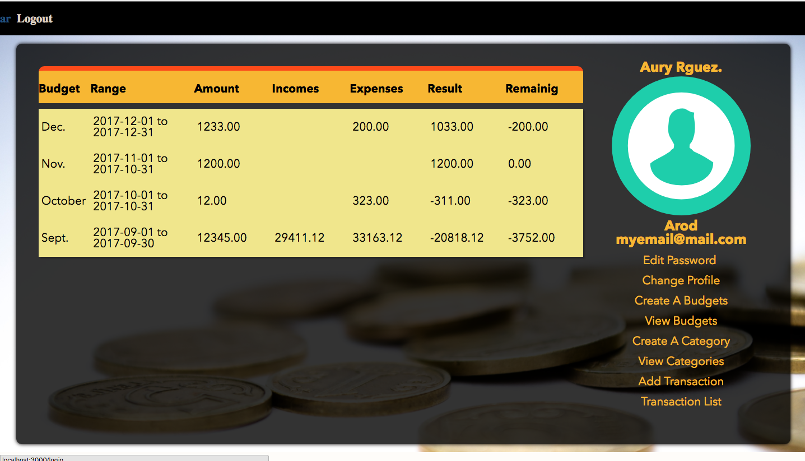
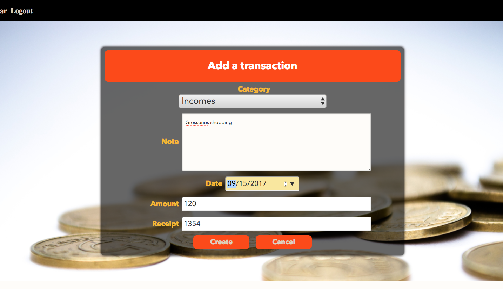

# 'Finances manager' App

'Finances manager' is an app where user can create their accounts so they can manage their finances.
Using budgets, they can control how much they spend. Categories it the way for the user  to group they incomes and expenses, and transaction is where the user can specify  in what they spent certain money. 

## Technology
This app was built using Express for the back end, React for the front end and Postgreslq for the database

## Users
This app was build for people who want to  keep track of their expenses and manage their finances.

## Opportunities for Future Growth
  I would like the page to look better

